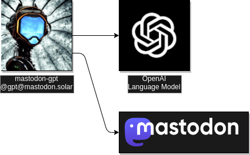
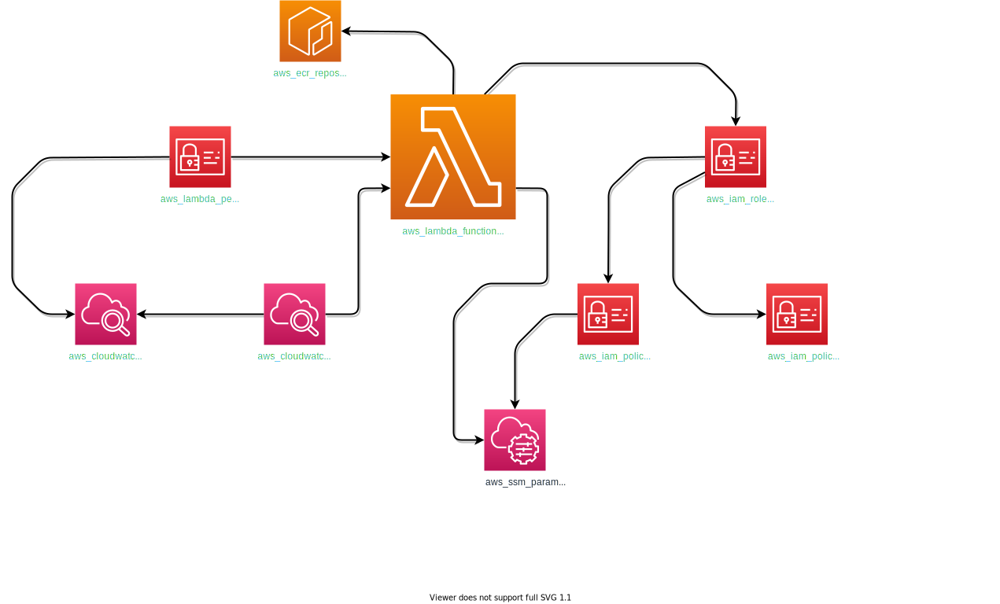

# mastodon-gpt

## Overview

`mastodon-gpt` is an open source serverless conversational chatbot that checks every X minutes
to see if it was mentioned on [Mastodon](https://joinmastodon.org/).  When the [AWS Lambda](https://aws.amazon.com/lambda/) function detects a mention, it uses an [OpenAI](https://beta.openai.com/) language model to generate a response based on the context of the mention (and the prior message if it exists) and then posts the response back to Mastodon as a reply.

The first deployed instance of this bot is `@gpt@mastodon.solar`.

Each mention (along with the prior message if present) is checked against the [OpenAI Moderations endpoint](https://beta.openai.com/docs/api-reference/moderations/create).
If the bot is asked to reply to content that fails any moderation check by OpenAI, then the bot will simply ignore the mention.
\
&nbsp;

## External Dependency Map

\
&nbsp;

## Deployment
Infrastructure is deployed to [AWS](https://aws.amazon.com/) via [Terraform](https://www.terraform.io/) from the `./terraform` folder.  The `./terraform/01-bootstrap` layer must be applied first.  See each layer's folder for deployment and config details.

\
&nbsp;

## AWS infrastructure layout

